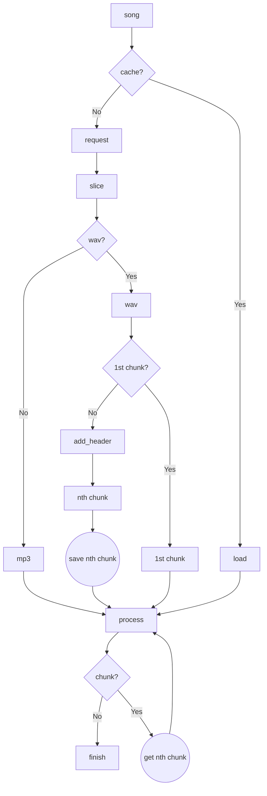

# Kun Keyboard

Kun keyboard for ikuns.

## Structure

```mermaid
flowchart TD
    song --> cache{cache?}
    cache -->|No| request
    cache -->|Yes| load
    request --> slice
    slice --> wav_check{wav?}
    wav_check -->|No| mp3
    wav_check -->|Yes| wav
    wav --> first_chunk{1st chunk?}
    first_chunk -->|No| add_header
    first_chunk -->|Yes| first_chunk_direct[1st chunk]
    add_header --> nth_chunk[nth chunk]
    nth_chunk --> save((save nth chunk))
    mp3 --> process
    save --> process
    first_chunk_direct --> process
    load --> process
    process --> chunk_check{chunk?}
    chunk_check -->|No| finish
    chunk_check -->|Yes| get_nth((get nth chunk))
    get_nth --> process
```
